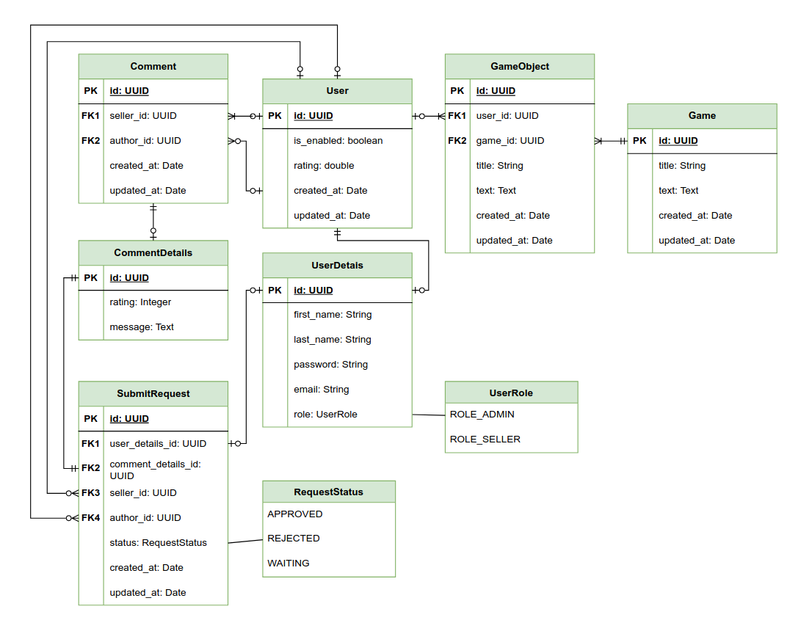

# Rating System

REST API written in Java using Spring Boot and documented with Swagger and OpenApi 3.1.0.

## Overview

The goal of the project is to provide an independent rating system for sellers of in-game items (CS:GO, FIFA, Dota, Team Fortress, etc.). The rating is based on comments submitted by users,
which are thoroughly verified by trusted individuals. These ratings form the basis for the overall top sellers in various game categories. There are three roles: Administrator, Seller, and Anonymous User.
The application uses JWT authentication and leverages Redis cache for temporarily storing user tokens. Flyway is used for managing migrations.

## Database schema 

Domain entities: User, UserDetails, Game, GameObject, Comment, CommentDetails, SubmitRequest. Two types of relationships between entities are used: One-To-One and One-To-Many.

## Core functionality

* JWT authentication and role-based access control for different parts of the API.
* Confirmation of registration and password reset process via email. Tokens are stored in the Redis cache.
* Ability to submit three types of requests: adding a comment to an existing seller, user registration, and creating a user along with adding a comment.
* Calculation of seller ratings and generation of a top seller list.
* Filtering Game Objects using the Criteria API.
* CRUD operations for domain entities.

## Deployment

The application has been deployed to the SAP BTP Cloud Foundry and is bound to the PostgreSQL and Redis services. The Maven 'cloud' profile was used for the deployment.

## Testing

The Maven 'test' profile is used for testing. The testing environment consists of two unit tests and two integration tests. For the integration tests, PostgreSQL containers are used as the data source.

## Links
* [Routes to the deployed instance of application](https://ratingsystem-delightful-aardvark-hq.cfapps.us10-001.hana.ondemand.com)
* [Swagger UI](https://ratingsystem-delightful-aardvark-hq.cfapps.us10-001.hana.ondemand.com/swagger-ui/index.html)